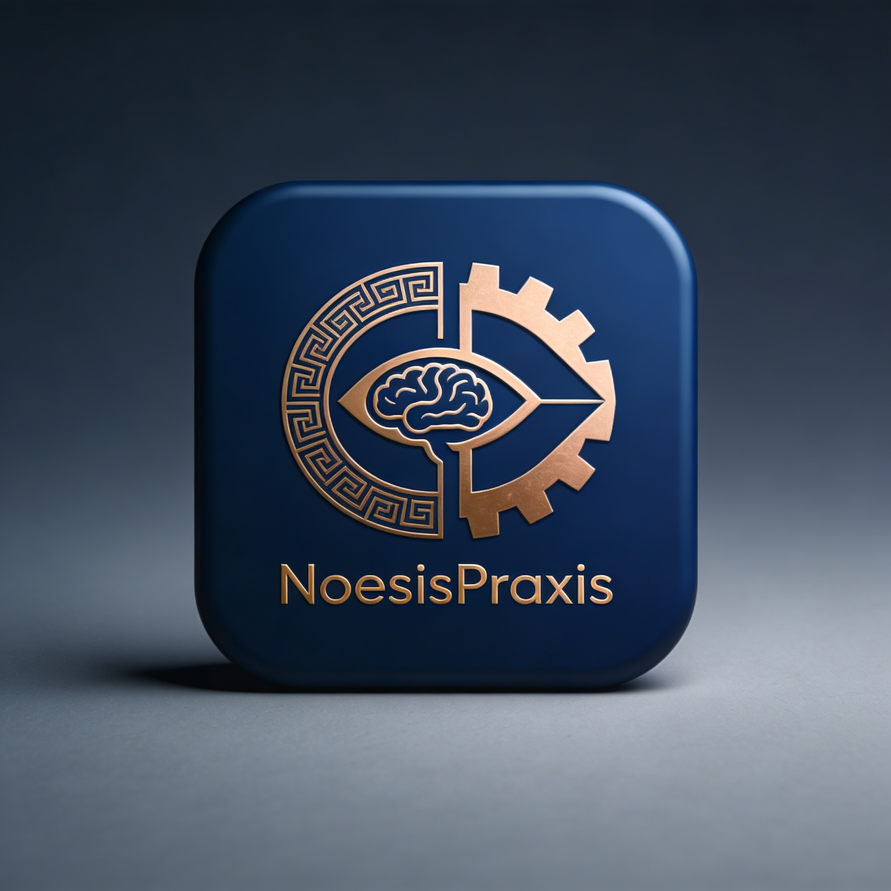

<p align="center">
  
</p>

<p align="center">
  <a href="#"></a>
  <a href="#"></a>
  <a href="#"></a>
  <a href="#"></a>
</p>

---

# Hermes–OpenClaw Multi-Agent System

A production-oriented multi-agent architecture that uses **Hermes Agent** as the primary supervisor and decision layer, while delegating specialized deep-work loops to **OpenClaw** workers for Research and Subconscious functions.

## Overview

This repository defines a hierarchical agent system with explicit role boundaries, durable artifacts, and approval-based handoffs. The design goal is to keep research, reflection, decision-making, building, verification, and publishing as separate responsibilities so the system compounds judgment rather than collapsing into a single over-privileged agent.

The core pattern is:

- **Hermes Main** as the conscious operator and orchestration spine.
- **OpenClaw Research Agent** as the evidence service that gathers signals, preserves source trails, and produces structured operator-facing artifacts.
- **OpenClaw Subconscious Agent** as the bounded pattern-noticer that explores ideas, maintains a room of ongoing thoughts, and emits build signals without gaining execution authority.
- **Hermes execution profiles** such as Coder, QA, Content, Ops, and other downstream agents that consume approved handoffs rather than raw external noise.

## Design principles

- **Supervisor-first control:** Hermes remains the only long-lived supervisory and approval authority in the system.
- **Specialized workers:** OpenClaw is used where persistent internal loops and bounded specialized cognition are more important than direct operator interaction.
- **Artifacts over chat:** Agents exchange durable files, ledgers, briefs, and handoff objects instead of relying on transient chat history as system memory.
- **Promotion gates:** A finding is not a claim, a claim is not verified knowledge, and a signal is not an approved task.
- **Explicit uncertainty:** Freshness, contradictions, degraded collectors, stale ideas, and blocked items must remain visible rather than being flattened into confident summaries.
- **Separation of duties:** Research collects, Subconscious notices, Main decides, Coder builds, and QA audits.

## Agent topology

| Agent | Runtime | Primary role | Inputs | Outputs |
|---|---|---|---|---|
| Main | Hermes Agent | Global context, prioritization, routing, approvals | Operator goals, research briefs, signal boards, handoff queues | Decisions, delegations, approvals |
| Research | OpenClaw | Collect, score, structure, and route evidence | Source plan, prior vault state, shared workspace context | Findings, claims, sources, dossiers, operator briefs, handoffs |
| Subconscious | OpenClaw | Notice recurring patterns, maintain idea room, emit build signals | Research snapshots, lessons, retrospectives, room memory | Walk notes, signal logs, signal board, intent drafts |
| Coder | Hermes Agent | Implement approved work | Approved plan, build handoff, verified context | Code, services, scripts, integrations |
| QA | Hermes Agent | Validate builds and evidence-linked outputs | Build artifacts, validation rules, evidence trails | Audit notes, test results, release gates |
| Content / Ops / Treasury | Hermes Agent | Act on approved domain handoffs | Approved dossiers and lane-specific handoffs | Domain outputs, reports, operational actions |

This split follows the source documents closely: the research layer is upstream of execution, and the subconscious layer contributes signal rather than authority.

## Research lane

The Research agent is designed as a durable evidence service rather than a summarizer or generic scraper. Its job is to collect bounded high-signal sources, extract findings, promote candidate claims carefully, preserve source lineage, and route implications into downstream queues and operator briefs.

The Research workspace should preserve at least these artifact classes:

- Raw captures for replay and audit.
- Findings, claims, and sources as separate machine-readable ledgers.
- Dossiers and wiki-style topic synthesis for recurring strategic lanes.
- Validation and health artifacts for freshness, structural integrity, and evidence linkage.
- Handoff files for build, verification, content, watch, ops, and treasury lanes as needed.

A first implementation milestone should prove the pipeline end to end with a narrow source set, durable ledgers, at least one dossier, and a usable operator brief.

## Subconscious lane

The Subconscious agent is a bounded internal worker that does not scrape the external world directly. Instead, it receives snapshots from the Research vault, wanders through a structured “room,” maintains fascinations and lessons, and emits build signals that are scored before they become candidate work.

Its purpose is not to produce content or tasks on demand, but to improve judgment over time by tracking what keeps returning, what cools off, what becomes durable after implementation, and what deserves a small experiment versus a full build.

The key control idea is that a build marker is only a signal. Main still plans and approves, Coder still implements, and QA still audits before anything becomes production work.

## Control flow

1. Research runs on a schedule and writes evidence artifacts into its vault.
2. Hermes Main reads operator briefs, dossiers, and handoff surfaces rather than raw collection output.
3. Selected Research outputs are copied into the Subconscious inbox as snapshots, not as direct instructions.
4. Subconscious performs scheduled walks, updates signal state, and emits build intents or experiment candidates when thresholds are met.
5. Hermes Main reviews those signals, writes or approves plans, and routes approved work to Hermes Coder.
6. Hermes QA validates outcomes and feeds results back into the long-term system memory and Subconscious lessons loop.

## Repository goals

This repository is intended to hold:

- Agent profiles and SOUL contracts.
- Shared policies, schemas, and handoff contracts.
- OpenClaw worker definitions for Research and Subconscious.
- Hermes profile configurations for Main, Coder, QA, and downstream execution lanes.
- Vault and room layouts for durable state.
- Scheduling, validation, health checks, and recovery procedures.
- Broker or protocol glue for typed interaction between Hermes and OpenClaw workers.

## Initial directory shape

```text
.
├── README.md
├── profiles/
│   ├── main-hermes/
│   ├── coder/
│   ├── qa/
│   ├── content/
│   ├── ops/
│   ├── treasury/
│   ├── research-agent/
│   └── subconscious/
├── workers/
│   ├── openclaw-research/
│   └── openclaw-subconscious/
├── contracts/
│   ├── schemas/
│   ├── handoffs/
│   └── policies/
├── workspace/
│   ├── research-vault/
│   ├── subconscious-room/
│   └── shared-handoffs/
├── orchestration/
│   ├── broker/
│   ├── schedules/
│   └── health/
└── docs/
    ├── architecture/
    ├── operations/
    └── decisions/
```

The exact layout will evolve, but the repo should preserve strong isolation between the Research vault, the Subconscious room, and the shared handoff surfaces used by Hermes-managed execution agents.

## Safety model

This system is designed around constrained autonomy.

- Research may collect and route information, but it must not make irreversible external decisions such as purchases, public publishing, or partnership commitments.
- Subconscious may notice, reflect, and propose build intents, but it must not write production code, approve its own ideas, alter thresholds to force promotion, or touch secrets and auth surfaces.
- Downstream Hermes agents should consume approved artifacts, not raw external inputs or weak signals.
- Validation, freshness checks, contradiction tracking, and release gates must block unsupported promotion.

## Roadmap

1. Scaffold repo structure, agent profiles, and contracts.
2. Implement the OpenClaw Research lane with a minimal bounded source plan and durable ledgers.
3. Implement the OpenClaw Subconscious lane with room state, walk modes, signal filter, and board state.
4. Wire Hermes Main to consume artifacts and route approvals.
5. Add Hermes Coder, QA, and lane-specific execution profiles.
6. Add health checks, validation, recovery, and observability.

## Status

This repository is currently in the specification and scaffold phase. The immediate next step is to turn the architecture into concrete profile definitions, contracts, workspace layouts, and an initial runnable slice that proves the Research → Main → Subconscious → Main → Coder/QA loop with durable artifacts and explicit gates.

